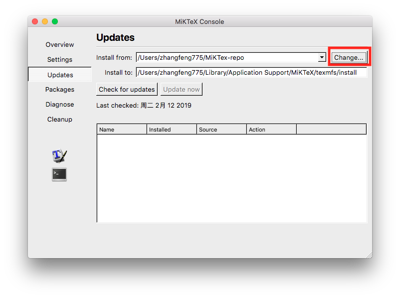
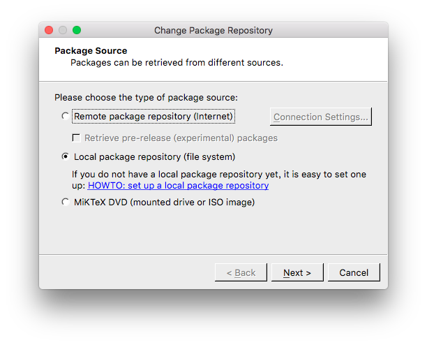
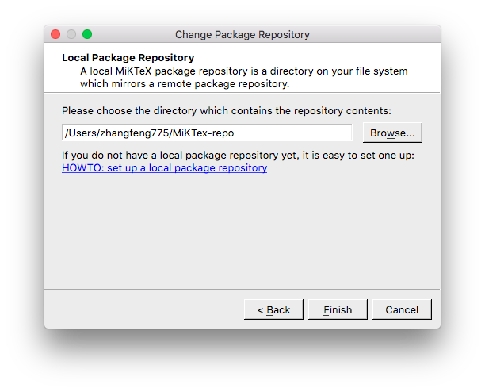
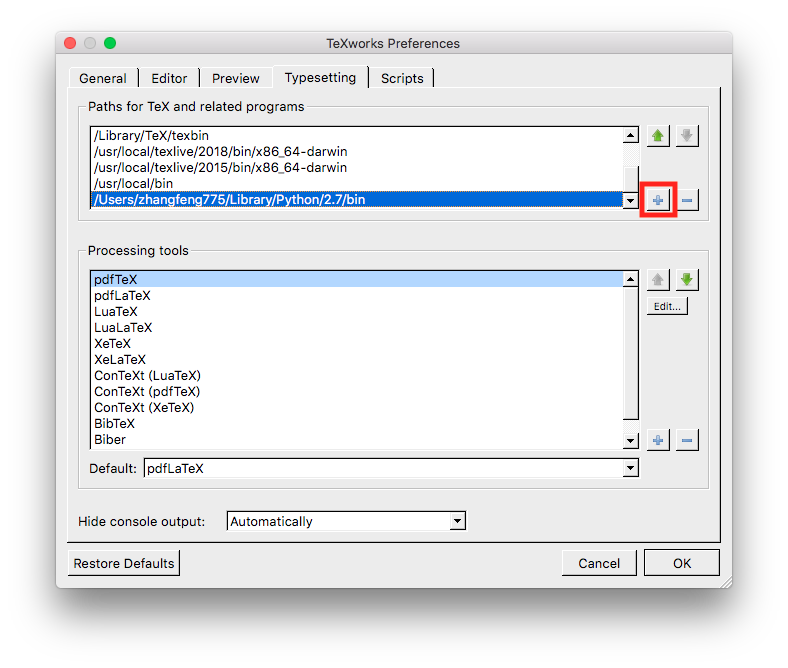
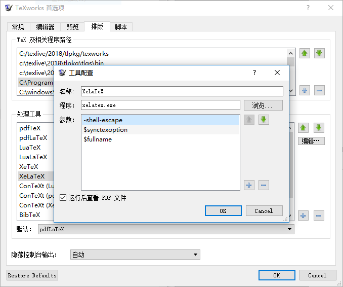
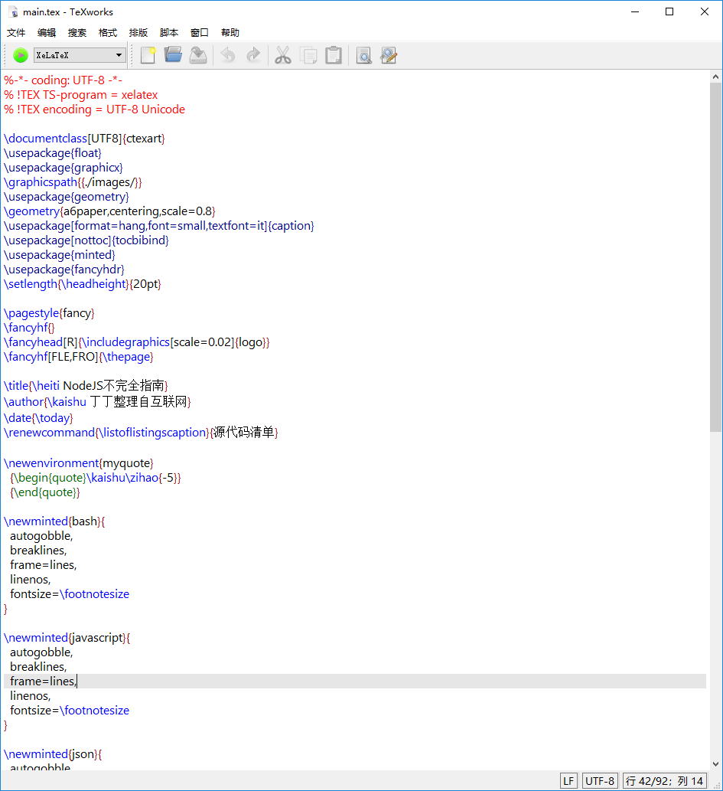
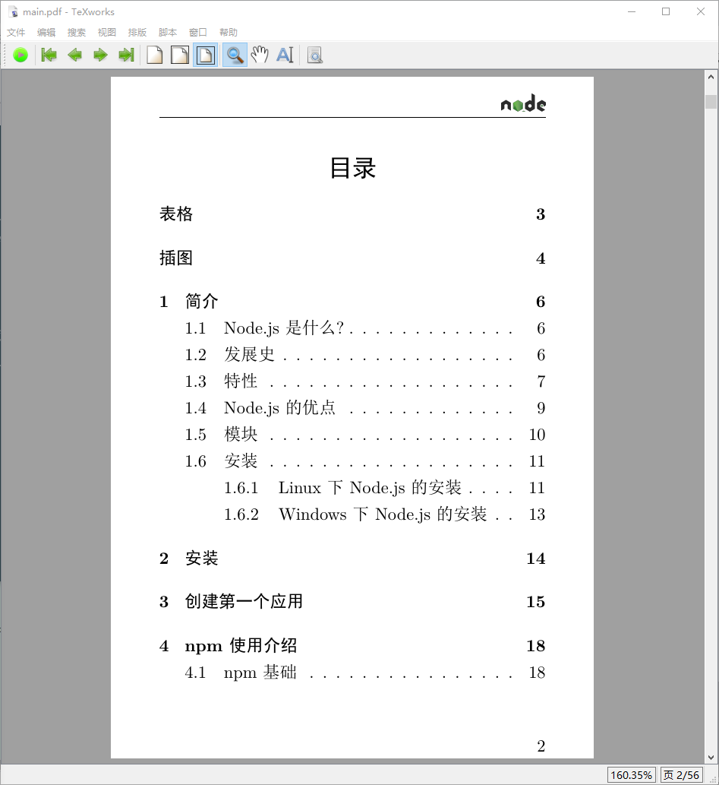

# Introduction

Collection of documents typeset in LaTeX.

## 工具安装

很显然你需要安装 LaTeX 及相关软件。请安装以下软件：

* [MiKTeX][1] for Windows User
* [MacTeX][5] for MacOS User
* [Python 3][2]
* [Pygments][3]
* [Git][4]

Windows 用户安装 MiKTeX 时请选择 private 模式，否则需要管理员权限。
MacOS 用户请选择[MacTeX][5]。该软件包虽然较大，但安装完几乎所有 package 都已囊括。
另外，推荐安装 VS Code + LaTeX Workshop 插件将显著提高编辑 LaTeX 文件的速度。
如果 Vim 用得顺手，推荐使用 Vim 进行 LaTeX 编辑。

### 安装配置源代码排版工具

为了避免网络问题导致的安装 latex 包失败，请配置 MiKTeX Console 使用本地仓库。
本地仓库只要将以下链接中的 tar 包下载并解压的某个固定目录即可。
该目录需要在 MiKTeX Console 改一下设置，让它从该目录中安装。配置步骤如下图所示：

Pygments 主要用来在文档中排版源代码。该工具和 LaTeX 模块 minted 配合使用效果最佳。
安装 Pygments 可以用 pip。如果没有系统管理员权限可以用--user 选项安装到
用户目录中去。

    pip install --user pygments

装完后需要把 pygmentize 这个命令所在目录放到 PATH 中。

接下来需要配置 TeXworks，使其排版时带上 minted 需要的选项-shell-escape
以及使其能够搜索到 pygmentize 这个命令。
打开 TeXworks，按“编辑”->“首先项”，进入“TeXworks 首先项”对话框，点击“排版”
标签页，首先在"Paths for Tex and related programs"列表中添加 pygmentize
命令所在的路径。在 Mac OSX 上一般安装到～/Library/Python/2.7/bin 目录下。
在 Windows 上，一般装到 Python 安装目录或虚拟环境的 Scripts 子目录。
定位好目录后，点击右边的增加按纽，然后在目录选择对话框中选择相应的目录。
具体操作如下图所示：

Mac OSX 上如果无法找到～/Library 目录，那么请按 Command+Shift+.三个按键，显示隐藏目录。

然后，在”处理工具“列表中选中 XeLaTeX，然后点击旁边的“编辑”按钮。
在弹出框的“参数”列表中增加“-shell-escape”选项并置顶。最终效果如图所示：

## 如何生成 PDF？

推荐使用两种方式。一种是用命令行工具生成。
另外，一种是使用 TeXworks 排版软件，它的好处在于可以实时预览 PDF。而且可以双向
追踪代码和文档局部区域。对于大型文档的增量维护比较有用。
这两种方式可以结合使用。

### 命令行生成 PDF

本项目的每个子项目都有自己的 Makefile，
只要运行 make 命令即可生成最终的 pdf 文档。使用该方法可以方便、快速、稳定的
产生最终的文档。适合在文档编写完成后使用。具体的操作如下：

* 打开命令行工具，Windows 下可以使用 gitbash，Mac OS X 下用 terminal 或 iterm
* Mac OS X 执行 make 命令，Windows 下则用 gmake 代替

一般有索引及参考文献的文档需要多至 4 次的编译才能生成完整的 PDF。
所以，对某些子项目执行 make 命令可能比较耗时。
LaTeX 编译时会产生大量中间文件，如果不需要这些文件可以执行

    make clean

进行清除。

### 使用 TeXworks 生成 PDF

使用 TeXworks 生成 PDF 比较简单，只要将相应的 LaTeX 源代码用 TeXworks 打开，
如下图所示：

然后，用按工具栏上绿色的按钮即可。
如果编译成功，那么会跳出如下图的预览窗口。

[1]: https://miktex.org/
[2]: https://www.python.org/downloads/
[3]: https://pypi.org/project/Pygments/
[4]: https://git-scm.com/
[5]: https://tug.org/mactex/
